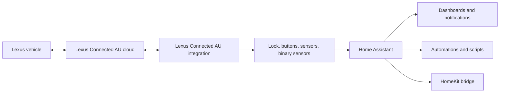

```text
             .-=================-.
          .-'                     '-.
        .'                           '.
       /      .-""""-.                 \
      ;      /  .--.  \                 ;
      |      | |    \  |                |
      |      | |     | |                |
      |      | |   _/ /                 |
      ;      \  '--'  /                 ;
       \       '-.__.-'                /
        '.                           .'
          '-.                   .-'
             '-================-'
                     LEXUS
```

# Lexus Connected AU for Home Assistant

<p align="center">
  
  &nbsp;&nbsp;&nbsp;
  
</p>

<p align="center">
  <strong>Less app tapping. More automations.</strong>
</p>

<p align="center">
  <a href="https://github.com/Kyry11/lex-ass"></a>
  <a href="https://hacs.xyz/"></a>
  
  
</p>

This repository provides a Home Assistant custom integration for the Lexus Connected Australia backend. It turns supported Lexus cloud features into native Home Assistant entities so you can use your vehicle in dashboards, scenes, scripts, notifications, HomeKit bridges, automations, and history views such as tracking tire pressure over time.

> [!IMPORTANT]
> This integration targets the Lexus Connected Australia platform. Other Lexus or Toyota regions use different auth flows and backend contracts and are not expected to work unchanged.



## What this repo does

- Adds a Lexus Connected AU integration to Home Assistant through `custom_components/lexus_au`.
- Exposes remote actions for day-to-day convenience, not just raw API experiments.
- Surfaces live vehicle state for dashboards and automations.
- Makes vehicle data part of normal Home Assistant history, so trends like tire pressure drift over time become visible.
- Uses fast command confirmation polling after actions, with jittered background polling and exponential backoff for regular refreshes.

## What you can do with it

| Area | Available in the integration |
| --- | --- |
| Remote control | Refresh vehicle, lock doors, unlock doors, flash hazards, engine start, engine stop |
| Trial actions | Lock boot, unlock boot, flash headlights, sound horn, buzzer warning |
| Core status | Fuel level, distance to empty, odometer, last vehicle update |
| Vehicle openings | Front doors, rear doors, front windows, rear windows, boot, bonnet, moonroof |
| Tire data | Front left, front right, rear left, and rear right tire pressure |
| Automation fit | Native Home Assistant entities for dashboards, scripts, scenes, notifications, and HomeKit export |

## Automation ideas

- Lock the car automatically when the house switches to night mode.
- Raise a notification if the boot, bonnet, or moonroof is still open after everyone leaves.
- Surface tire pressure and odometer on a vehicle dashboard card.
- Track tire pressure over time and spot a slow leak before it becomes an annoying surprise.
- Flash hazards from a dashboard tile to find the car in a crowded car park.
- Export explicit `Lock doors` and `Unlock doors` buttons through Home Assistant to HomeKit.
- Build a morning scene that puts vehicle status next to weather, driveway presence, and charging information.

## Install with HACS

HACS is the recommended path.

1. Open HACS in Home Assistant.
2. Go to `Integrations`.
3. Open the menu in the top-right corner, then choose `Custom repositories`.
4. Add `https://github.com/Kyry11/lex-ass` as a repository of type `Integration`.
5. Install `Lexus Connected AU`.
6. Restart Home Assistant.
7. Go to `Settings -> Devices & Services -> Add Integration`.
8. Search for `Lexus Connected AU`.
9. Enter your Lexus account email, password, VIN, `API key`, and `X-API key`.

After setup, start with:

1. `Refresh vehicle`
2. `Lock doors`
3. `Unlock doors`
4. `Flash hazards`
5. Sensor and binary sensor checks on your Lexus device page

## Manual install

If you prefer not to use HACS, copy `custom_components/lexus_au` into your Home Assistant config directory under:

```text
custom_components/lexus_au
```

Then restart Home Assistant and add `Lexus Connected AU` from `Settings -> Devices & Services`.

## What you need

- Home Assistant
- A Lexus vehicle/account with the relevant connected services enabled
- Your VIN
- Working Lexus app API credentials for the `API key` and `X-API key` fields

This repository intentionally does not publish certain app-level secrets or keys. If you want full remote functionality, you will likely need to obtain the required values from your own environment and research workflow.

## Notes for contributors

- Stable user-facing features should feel like normal Home Assistant entities, not debugging hooks.
- AU-specific findings, protocol notes, and implementation history live in [`docs/`](docs/).
- If you can confirm or refine the current trial actions on additional Lexus AU models, issues and pull requests are useful.

## Legal and safety

- This is an unofficial community project. It is not affiliated with, endorsed by, or supported by Lexus, Toyota Motor Corporation, Toyota Connected, Home Assistant, Nabu Casa, the Open Home Foundation, or their affiliates.
- Lexus names, marks, connected-service software, and related intellectual property belong to their respective owners.
- Home Assistant names, marks, software, and related intellectual property belong to their respective owners.
- The Lexus and Home Assistant logos shown in this README are displayed for identification only. The rendered SVG marks are served via Simple Icons as convenience artwork; all underlying trademarks remain the property of their respective owners.
- This integration can send real commands to a real vehicle. Use it carefully, test new automations in a safe environment, and assume remote-service behavior may change without notice.
- This repository is provided as-is, without warranty of any kind, and the maintainers accept no liability for vehicle behavior, service changes, account issues, or third-party intellectual-property claims arising from use of this project.
